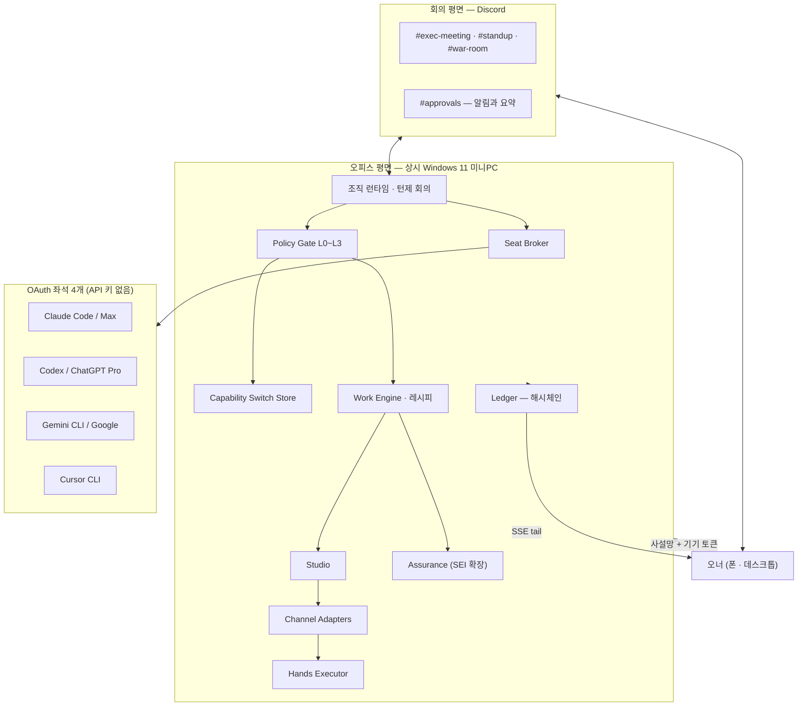
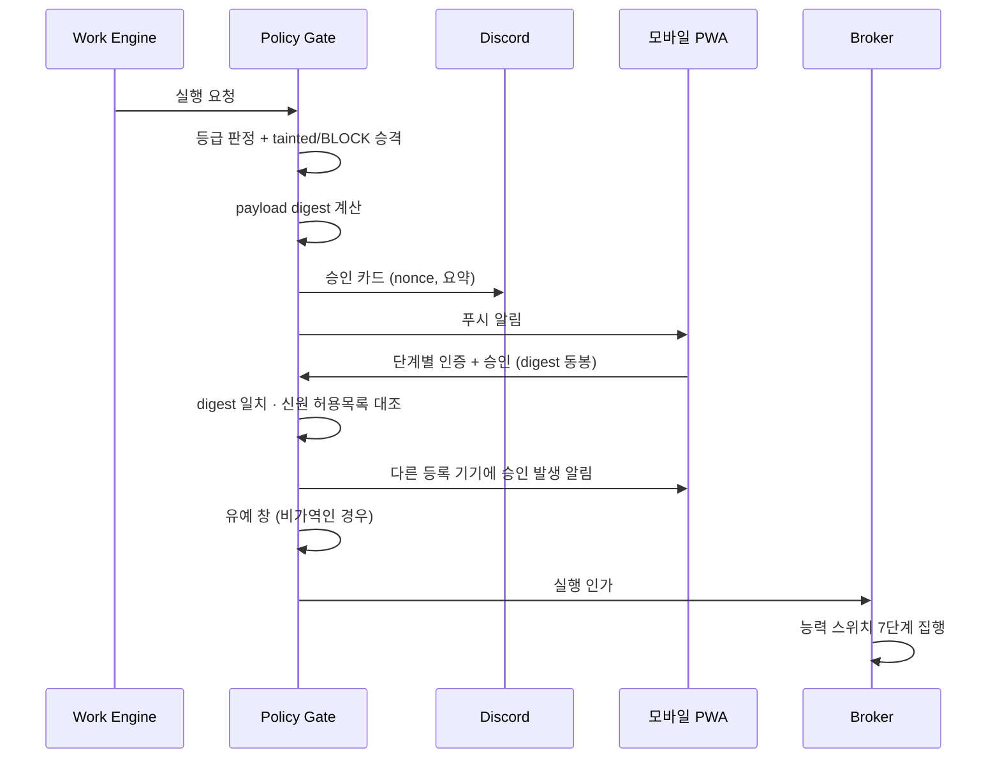

# Design Document — agentlas-company

## Overview

설계의 중심 아이디어는 하나입니다: **읽는 것과 실행하는 것을 다른 프로세스, 다른 OS 사용자, 다른 인터페이스로 분리한다.** 에이전트는 매일 신뢰할 수 없는 외부 텍스트를 읽고, 동시에 돈과 계정에 닿는 손을 갖습니다. 둘이 한 프로세스에 있으면 프롬프트 하나로 회사가 조종됩니다. 그래서 자유 텍스트는 구역 경계를 넘지 못하고 타입 지정된 동사 호출만 넘어갑니다.

두 번째 축은 **증거**입니다. 모든 발언·조작·발행이 해시체인 원장에 남고, 라이브오피스·히스토리·검증·복기가 전부 그 하나의 자료구조를 읽습니다. 별도 상태 저장소를 만들지 않습니다.

## 런타임 결정

**주 언어는 Node/TypeScript.** 상위 프로젝트(`ai-company-discord`)는 Python 단일을 골랐고 근거는 재사용 로직이 전부 Python이라는 것이었습니다. 우리 조건은 다릅니다. 최대 재사용 자산이 `proc.js`(Windows 인용·PATH·프로세스 트리 종료를 이미 해결한 코드)이고, 새로 만들 무거운 셋 — Hands(CDP 브라우저 조작), 라이브 스트림(SSE), 모바일 PWA — 이 전부 Node 생태계에 두껍습니다.

**Python 업스트림은 서브프로세스로 소비.** `--json` 출력에만 바인딩하고 내부 구현에는 의존하지 않습니다.

> **정정(2026-08-03, Task 18.1).** 위 문장은 원래 "`companyctl`과 `sei`가 `--json` 출력과 **균일한 종료 코드(0 성공 / 1 발견 / 2 실행 불가)** 를 출하했으므로" 라고 적혀 있었습니다. `contentscoin/agentlas-sei` v0.3.0 을 붙여 실측한 결과 **그런 계약이 아닙니다.**
>
> | 종료 코드 | 실제 의미 |
> | --- | --- |
> | 0 | 성공 — `inspect` 는 **high 심각도 발견이 있어도 0** |
> | 2 | 실행 불가(SEIError/OSError) 또는 `validate` 상태 무효 |
> | 3 | `self-audit` 미통과 |
> | 4 | `gate`/`review` 미허가 |
>
> **`1`(발견)은 존재하지 않습니다.** 그래서 `sei inspect` 를 레시피 게이트 명령으로 그대로 쓰면 high 발견 4건에도 게이트가 **통과**합니다(실측 확인). 위험 신호는 반드시 **JSON 본문**에서 읽어야 하고, 종료 코드는 "돌았는가" 만 판정합니다.
>
> 설계가 기대한 균일 계약은 우리가 **제공**합니다 — `company sei` 가 0/1/2 로 나가므로 레시피 `gate` 스텝이 그대로 씁니다. `src/assurance/sei.ts` 참조.
>
> 또한 SEI 의 검사 대상은 **코드 프로젝트**입니다(모든 하위 명령이 프로젝트 디렉터리를 받습니다). 게시물 본문을 검사시킬 명령이 없으므로 `company assure <본문>` 에서 SEI 는 "설치되지 않음" 이 아니라 **대상이 아님** 입니다.

**좌석 호출은 매번 일회성 비대화형 실행.** 장기 세션을 유지하지 않습니다. 구독 CLI가 장수 세션을 보장하지 않고, 상태가 프로세스에 숨으면 크래시 복구와 재현이 불가능해집니다. 비용은 매 호출마다 컨텍스트를 다시 싣는 것이고, 이를 **컨텍스트 팩**(역할 정의 + 관련 원장 발췌 + 인용 팩)으로 조립해 재현 가능하게 만듭니다. 같은 팩으로 같은 호출을 다시 돌릴 수 있어야 합니다.

## 구역과 프로세스 배치

| 구역 | Windows 사용자 | 프로세스 | 접근 가능 자산 |
|---|---|---|---|
| Z0 | (사람) | 없음 | 2FA 시드·복구코드·결제수단. 기계에 저장하지 않음 |
| Z1 | `svc-broker` | Publish Broker, Hands Executor, Ledger, Switch Store | 채널 토큰, 브라우저 프로필, 원장, 능력 스위치 |
| Z2 | `svc-seats` | 좌석 4개, 회의 엔진, Studio | 자기 호스트 OAuth 디렉터리, per-run 작업 디렉터리 |
| Z3 | — | (데이터) | 웹·댓글·DM·검색결과, 차용 Hub 패키지, 생성 코드 |

경계 통과 규칙 셋.

```
Z3 → Z2 : 데이터로만. 지시 슬롯에 넣지 않는다. 신뢰등급 태그 필수.
Z2 → Z1 : 타입 지정 동사 호출만. 자유 텍스트 실행 경로 없음.
Z1 → Z2 : 집계값만. 고객 PII 원본 금지.
```



## agentlas-desktop 경계

`agentlas-desktop`(v0.9.29, Electron+Next, TS/TSX 627개)은 형제 제품이고 **실행 표면을 이미 가졌습니다.** Task 9~17 을 세울 때 이 저장소를 계산에 넣지 않았고, 그래서 Hands·모바일·Studio·채용을 처음부터 만들 계획이었습니다. 그 계획을 정정합니다.

**분업 원칙: company 는 통제, desktop 은 실행.** company 가 고유하게 가진 것은 desktop 에 없습니다 — 해시체인 원장, 정책 등급·승인 게이트, 능력 스위치, 오염 추적, 크로스벤더 회의 프로토콜. desktop 이 가진 것은 company 에 없습니다 — 네이티브 입력 드라이버, CDP 브라우저, 모바일 페어링·릴레이, 좌석 런타임 어댑터 7종(11,185줄). 겹치는 것을 두 번 만들지 않습니다.

**연동 가능 범위는 헤드리스 도달성이 정합니다.** desktop 기능의 대부분은 `electron/ipc.ts` 의 `ipcMain.handle` **486개** 뒤에 있고, 이건 Electron 렌더러에서만 호출됩니다. company 는 헤드리스 CLI이므로 닿지 않습니다. 밖으로 나온 표면은 넷뿐입니다.

| desktop 표면 | 프로토콜 | 플랫폼 | company 쪽 소비자 |
|---|---|---|---|
| `mcp-tools/browser-cdp-launcher.ts` | MCP stdio (`@playwright/mcp` 프록시) | 전부 | **Hands Executor (Task 10)** |
| `mobile-bridge/server.ts` | HTTPS/WSS + 페어링 + authority | 전부 | **없음** — 아래 참조 |
| `browser/approval-server.ts` | loopback HTTP | 전부 | 런처가 직접 호출 (민감 행동 승인) |
| `mcp-tools/registry.ts` | 외부 MCP 등록 (stdio/sse/http) | 전부 | company 를 도구로 등록 (Task 16) |
| `computer-use/control-server.ts` | loopback HTTP + Bearer | **macOS 전용** | 없음 — 아래 참조 |

**computer-use 는 macOS 전용입니다.** `control-server.ts:236` 이 `process.platform !== 'darwin'` 이면 서버를 띄우지 않고, `native-driver.ts:47` 도 같으며 `native/` 에는 `macos` 만 있습니다. 우리 운영 대상은 Windows(§Windows 배치)이므로 이 표면은 **쓰지 않습니다.** 1차 재정의(2026-08-02)는 Task 10 을 여기 붙인다고 적었고 그것은 틀렸습니다 — 그대로 만들었다면 대상 플랫폼에서 한 줄도 돌지 않았을 것입니다.

Hands 가 실제로 붙는 곳은 desktop 이 `~/.agentlas/agentlas-browser-cdp.mjs` 로 물질화하는 CDP 런처입니다. 의존성 0 의 순수 node 스크립트이고, 전용 Chrome 프로필(`~/.agentlas/chrome-cdp-profile`)을 원격 디버깅 포트로 띄운 뒤 `@playwright/mcp` 를 CDP 로 붙입니다. 로그인 세션이 유지된 전용 프로필이라는 점이 R7.1 그 자체이고, 신선한 임시 프로필이 봇 차단에 걸리는 문제를 desktop 이 이미 풀어 놓았습니다.

**조작 하나에 게이트가 둘입니다.** company 의 승인 게이트를 통과해도, 런처가 결제·게시·삭제·임의코드를 감지하면 desktop 승인 UI 로 다시 막습니다. 런처는 현재 페이지 URL 을 CDP 로 확인할 수 없으면 민감 행동을 진행하지 않습니다(fail-closed). 우리 게이트를 지나 desktop 게이트에서 멈추는 것은 정상 동작이며, 실행기는 그것을 `step-failed` 로 보고하고 체크리스트를 냅니다.

**mobile-bridge 는 붙일 수 없습니다.** 크로스플랫폼이고 밖으로 나와 있지만, `projector.ts` 가 desktop 내부 스토어(`../store/firms`, `../store/projects`, `../confirm`, `../secrets/vault`, `../usage`, `../one/*`)를 직접 import 해 **자기 상태만** 투영합니다. 외부 시스템을 끼울 확장점·피드·설정이 없습니다. 브리지는 desktop 이 아는 것을 폰에 보여주는 닫힌 투영이고, company 의 원장·승인·능력 스위치는 desktop 이 모릅니다. Task 10 의 computer-use 가 **플랫폼** 문제였다면 이쪽은 **결합도** 문제이며, 어느 쪽도 company 코드로는 풀리지 않습니다.

그래서 오피스 API 는 company 가 전부 소유합니다(`src/office/`). 모바일 표면을 어떻게 낼지는 열려 있습니다 — company 가 PWA 를 직접 내거나, desktop 에 확장점 PR 을 올리거나, company 를 MCP 도구로 등록(Task 16)하는 셋 중 하나입니다.

단계별 인증은 TOTP(RFC 6238)입니다. 설계 초안은 desktop 페어링 기기를 두 번째 요소로 쓰려 했으나 위 결합도 문제로 불가능합니다. TOTP 는 소유 요소(폰)를 검증하면서 company 밖에 의존하지 않고, 기본 검증기가 **전부 거부**라 등록하지 않은 채로 L3 이 열리지 않습니다.

Hands 가 노출하는 동사는 8종뿐입니다. `@playwright/mcp` 의 도구는 훨씬 많지만 전부 열지 않습니다 — `browser_evaluate`(임의 JS 실행은 자유 텍스트가 실행이 되는 바로 그 경로), `browser_cookie_*`·`browser_localstorage_*`(자격증명 표면은 좌석 구역이 읽을 것이 아닙니다, R15), `browser_mouse_*_xy`(좌표 조작은 화면이 바뀌면 조용히 엉뚱한 곳을 누릅니다). 제외 목록과 이유는 `src/hands/types.ts` 주석에 고정해 두었습니다.

**MCP 등록은 집행이 아닙니다.** desktop 의 외부 MCP 레지스트리에 company 를 stdio 서버로 올리면 desktop 안의 에이전트가 원장 기록·승인 요청을 **할 수 있게** 됩니다. 하지만 desktop 자신의 동작이 우리 게이트를 **거치지는** 않습니다. MCP 는 도구를 제공하지 호출을 가로채지 않습니다. 이 구분을 흐리면 "초록인데 틀린 상태"가 됩니다 — 원장에 기록은 쌓이는데 아무것도 막지 못하는 상태.

그래서 집행은 **실행 표면이 실행 전에 직접 묻는** 형태로 만들었습니다 (Task 16.0 완료).

```
desktop installAgent()  ──spawn──▶  company gate --action agent.borrow --digest <d> --json
                                          │
                                          ├─ 종료 0  인가        → persistListing() 진행
                                          ├─ 종료 1  거부        → throw, 설치 중단
                                          └─ 종료 2  묻지 못함    → throw, 설치 중단
```

계약의 세부는 셋입니다.

- **종료 2 를 1 과 구분합니다.** "안 된다고 답했다"와 "물어보지 못했다"는 다른 사실이고 답인 것은 앞의 하나뿐입니다. 다만 처리는 둘 다 거부입니다 — 2 를 통과로 해석하면 게이트를 끄는 방법이 게이트를 고장내는 것이 됩니다. spawn 실패·타임아웃도 같습니다.
- **CLI 경로는 절대 경로여야 합니다.** 맨 이름은 PATH 로 해석되고, 그러면 PATH 섀도잉이 진짜 게이트를 대신해 "허용"이라 답하는 경로가 됩니다. 보안 통제를 PATH 로 해석하지 않습니다.
- **승인은 동작을 결정하는 필드의 digest 에 묶입니다** — 지시문·trust grade·MCP 서버·env 요구 키 + Hub 릴리스 해시. Hub 가 준 `packageHash` 를 단독으로 신뢰하지 않는 이유는, 같은 해시로 내용만 바뀐 패키지가 무해한 버전에 내준 승인을 재사용할 수 있기 때문입니다 (R4.6).

프로세스 경계를 넘는 것은 식별자뿐입니다. 지시문과 env 값은 넘어가지 않습니다.

기본은 꺼져 있습니다. `AGENTLAS_COMPANY_GATE_CLI` 가 없으면 desktop 은 단독 제품으로 그대로 동작합니다. 켠다는 것은 막힐 수 있다는 데 동의한다는 뜻입니다.

**재사용 자산이 없는 것도 확정했습니다.** desktop 에 채널 발행 구현은 없습니다. `creative-pack/`·`ecommerce-pack/` 은 각각 `surface.ts` 하나이고 `threads`·`instagram` 은 `experience/taxonomy.ts` 와 `mcp-tools/catalog.ts` 의 문자열입니다. 따라서 **Task 9(첫 발행 루프)는 그대로 company 의 자체 구현으로 남습니다.** 요구사항의 "빈 기계 리스크"가 지목한 우선순위는 이 정정 이후에도 유효합니다.

## Seat Broker

```ts
type SeatId = 'claude' | 'codex' | 'gemini' | 'cursor';

interface SeatSpec {
  id: SeatId;
  vendor: 'anthropic' | 'openai' | 'google' | 'cursor';
  command: string[];            // SEAT-CONTRACT.md 실측값
  maxConcurrent: number;        // 실측값
  dailyBudget: number;          // Gemini는 1000 (공표치: 60/분, 1000/일)
  stripEnv: string[];           // R1.1 — 삭제할 API 키 변수
}

interface AskRequest {
  persona: PersonaId;
  pack: ContextPack;            // 재현 가능한 입력 전체
  preferSeat?: SeatId;
  forbidVendor?: string;        // Critic 크로스벤더 강제 (R3.4)
  timeoutMs: number;
}

interface AskResult {
  seat: SeatId;
  text: string;
  tainted: boolean;             // 팩에 신뢰등급 0이 있었으면 true (R16.3)
  eventId: string;
  usage: { queuedMs: number; ranMs: number; budgetLeft: number };
}
```

스폰은 `proc.js` 규약을 씁니다. `extra` 값이 `undefined`면 환경변수를 **삭제**하므로 `stripEnv`가 그대로 표현됩니다. 종료는 `taskkill /T /F`로 손자 프로세스까지 정리하고, 생존 확인에 `os.kill(pid, 0)`을 쓰지 않습니다 — Windows에서 그 호출은 확인이 아니라 종료입니다.

폴백 체인은 벤더 격리를 깨지 않는 범위에서만 동작합니다. Critic 요청이 `forbidVendor`를 만족하는 좌석을 못 찾으면 폴백하지 않고 실패합니다.

## 조직과 회의

좌석(4) < 임원(6+) 이므로 실시간 난상토론은 불가능합니다. 2라운드 턴제가 그 제약 안에서 의견 다양성을 지키는 방법입니다.

```
1라운드  각 임원 독립 의견 수집 (서로 노출 안 함)      R3.1
2라운드  다른 임원 1라운드 전문 제공 → 반론 수집        R3.2
집계     CEO가 DECISION / OPEN / ACTIONS 마감 블록      R3.3
검증     companyctl decision --json → 원장 적재         R3.6
```

Critic은 반드시 본체와 다른 벤더 좌석에서 발언합니다. 의견 다양성을 프롬프트 연기가 아니라 서로 다른 모델로 확보하는 것이 요구 9의 실질적 구현입니다. CRITICAL dissent 한 건은 다수결로 기각되지 않고 Board 게이트로 올라갑니다.

### War Room 트리거 둘 (R3.7)

R3.7은 트리거가 둘입니다 — **동일 과제 2회 실패** 또는 **Critic BLOCK**. Task 6.2 실측에서 앞쪽 트리거에 대응하는 코드가 **아예 없다는 것**을 발견했습니다. `MeetingOptions.stateDir` 주석은 "실패 카운터가 여기 쓰인다"고 약속하고 있었지만 그 카운터를 읽고 쓰는 코드가 없었고, 그래서 같은 안건이 몇 번을 실패하든 오너에게 올라가지 않았습니다. 회의는 매번 새 프로세스에서 돌므로 이 카운터는 반드시 프로세스 밖에 있어야 합니다 — 안에 두면 "2회 연속"이 성립할 수가 없습니다. 장부는 상태 루트 아래 `org/failures.json`(0600)입니다.

**"동일 과제"는 정규화한 안건의 정확 일치입니다.** 정규화는 의미가 아닌 것만 건드립니다(NFC, 앞뒤·내부 공백, 라틴 대소문자, 끝 문장부호). 조사나 어미는 손대지 않습니다 — 한국어에서 그것을 깎기 시작하면 어디서 멈출지 규칙이 없습니다.

**의미 유사도로 묶지 않습니다.** 묶으려면 좌석 호출이 필요하고, 그러면 통제 경로가 비결정적이 됩니다 — 같은 입력이 어떤 날은 War Room을 부르고 어떤 날은 안 부릅니다. 대가는 명시합니다: `가격 정책을 정하자`와 `가격 정책 정하자`는 따로 셉니다. 이 카운터는 **과소 계수하는 쪽으로** 틀립니다. 헛 소집이 반복되면 오너가 War Room을 무시하게 되고, 그러면 통제 자체가 사라지기 때문입니다.

**키는 안건의 digest입니다.** 원장이 안건 전문을 남기지 않는 것과 같은 규칙이며(R9), 여기만 예외로 두면 통제 상태 파일이 안건 아카이브가 됩니다.

**성공하거나 소집되면 연속을 끊습니다.** 성공에서 끊지 않으면 몇 달 전 실패 한 번이 다음 실패와 이어져 엉뚱한 시점에 소집되고, 소집 뒤에 끊지 않으면 그 안건이 다음 실패마다 영구히 경보를 냅니다. 두 트리거는 `warRoomCause`로 구분해 남깁니다 — 오너가 볼 화면과 할 일이 다릅니다.

## 허용 동사

Hands와 채널 어댑터는 열린 인터페이스가 아니라 닫힌 목록입니다.

```ts
type Verb =
  | { op: 'post_text';     channel: Channel; body: string; schedule?: ISO8601 }
  | { op: 'upload_media';  channel: Channel; assetId: string; caption: string }
  | { op: 'set_schedule';  channel: Channel; postId: string; at: ISO8601 }
  | { op: 'read_metrics';  channel: Channel; range: DateRange }
  | { op: 'reply_comment'; channel: Channel; commentId: string; templateId: string };
```

`reply_comment`가 `templateId`만 받는 것이 핵심입니다. 자유 텍스트 응답을 허용하면 인젝션이 곧바로 외부 발화가 됩니다. 파라미터는 스키마 검증을 거치고 URL은 도메인 허용목록과 대조합니다.

## 능력 스위치 (R8)

```ts
type RiskyCapability =
  | 'payout_account_change' | 'credential_change' | 'product_delete'
  | 'price_bulk_change'     | 'order_cancel_refund' | 'post_bulk_delete'
  | 'account_delete'        | 'dm_send' | 'mass_follow' | 'spend';

interface CapabilitySwitch {
  capability: RiskyCapability;
  enabled: boolean;                                    // 출하 시 false (R8.1)
  expiresAt: ISO8601 | null;                           // ON일 때 필수 (R8.4)
  scope: { channels: Channel[]; accounts: string[] };  // 범위 밖 부여 금지 (R8.12)
  lastChangedBy: { device: DeviceId; at: ISO8601 };
}
```

집행 순서를 고정합니다. 하나라도 실패하면 실행되지 않습니다.

```
1. 스위치 ON 확인       → OFF면 거부 + 원장 기록                R8.3
2. 유효기간 확인        → 만료면 OFF 복귀 후 거부                R8.5
3. 범위 확인            → 대상이 scope 밖이면 거부               R8.12
4. tainted 확인         → tainted면 ON이어도 거부                R16.5
5. L3 개별 승인 확인    → digest 바인딩 검증                     R8.6, R4.5
6. 유예 창 대기         → 중단 신호가 오면 취소                  R4.11
7. 실행 + 증거 기록
```

스위치 저장소는 Z1에 있고 `svc-seats`의 읽기·쓰기가 ACL로 거부됩니다(R15.8). 에이전트가 스위치 변경을 문장으로 요청해도 그것은 실행 가능한 요청 타입이 아니라 그냥 텍스트입니다(R8.9). 재부팅하면 전부 OFF로 복귀하므로 "켜둔 걸 잊는" 실패가 시간이 지나면 자동 치유됩니다(R17.3).

## 승인 흐름



디자인 판단을 하나 기록합니다. 승인 **제출**은 반드시 인증된 PWA를 통과합니다. Discord 카드는 알림과 요약만 담당하고 버튼 클릭 자체가 승인이 되지 않습니다. 이유: Discord 계정 하나가 뚫리면 방어선이 사라지는데, 오너가 모바일 전 등급 승인을 요구했으므로 인증 강도를 기기 쪽으로 옮겨야 합니다.

## 원장 스키마

```ts
interface LedgerEvent {
  id: string;
  seq: number;
  at: ISO8601;
  prevHash: string;            // SHA-256 체인 (R9.1)
  hash: string;
  actor: { kind: 'agent' | 'owner' | 'system'; id: string; seat?: SeatId };
  kind: 'seat.call' | 'meeting.turn' | 'decision' | 'gate.verdict'
      | 'approval' | 'switch.change' | 'hands.step' | 'publish'
      | 'deny' | 'retro' | 'ingest';
  level?: 'L0' | 'L1' | 'L2' | 'L3';
  tainted?: boolean;
  payloadDigest: string;       // 본문은 별도 저장, 원장에는 digest만
  evidence: string[];          // 스크린샷·URL·커밋 해시 경로
}
```

원장 파일 쓰기는 Ledger 서비스만 합니다. 좌석은 API로 제출합니다(R9.3). `deny` 이벤트가 침해 탐지의 주 신호이므로 별도 종류로 둡니다.

라이브오피스·히스토리·리플레이·복기가 모두 이 하나의 스트림을 읽습니다. 라이브오피스는 원장 tail의 실시간 투영이지 별도로 합성한 상태가 아닙니다 — 표시할 이벤트가 없으면 아무것도 표시하지 않습니다(R10.3).

## 채널 어댑터

두 경로가 같은 계약을 받습니다.

| 채널 | 경로 | 비고 |
|---|---|---|
| Threads, Instagram, YouTube, TikTok, WordPress | OAuth API | 사용자 계정 OAuth |
| 네이버 블로그, 네이버 클립, 스마트스토어, 카카오채널 | Hands | 공개 발행 API 없음 |

멱등성은 `PublishRequest.idempotencyKey`(콘텐츠 digest + 채널 + 예정시각)로 보장합니다. 같은 키가 원장에 성공으로 있으면 재발행하지 않습니다(R6.3).

Hands 실패는 흔합니다. 요소를 못 찾으면 즉시 중단하고 실패를 기록합니다 — 조용한 성공 처리가 최악입니다(R7.5). 그리고 사람이 이어받을 체크리스트를 생성합니다(본문 클립보드 준비 + 남은 단계 목록).

스마트스토어는 예외 규칙이 하나 더 붙습니다. 주문 데이터에 고객 이름·주소·연락처가 있으므로 Hands는 집계값만 반환합니다(R7.6). 이것은 보안 이전에 개인정보보호법 노출 문제입니다.

## Windows 배치

| 항목 | 설정 |
|---|---|
| 계정 | `owner`(관리자) / `svc-seats` / `svc-broker`. 서비스 계정은 비관리자 |
| ACL | `icacls`로 상속 차단 후 명시 부여. 좌석은 자기 호스트 OAuth 디렉터리만 |
| 디스크 | BitLocker 전체 디스크 암호화 |
| 기동 | 작업 스케줄러 또는 NSSM, 각 서비스를 해당 사용자로. 자체 supervisor 없음 (R12.6) |
| 방화벽 | 인바운드 기본 거부. 오피스 API는 loopback + 사설망 인터페이스만 (R14.1) |
| 감사 | 자격증명 디렉터리 객체 액세스 감사 활성. `deny` 급증이 탐지 신호 |

상위 프로젝트가 기록한 Windows 지뢰 셋을 처음부터 피합니다: `os.kill(pid, 0)`은 생존 확인이 아니라 종료이므로 쓰지 않고, `SIGKILL`이 없으므로 `taskkill /T /F`를 쓰고, `tail -f`가 없으므로 자체 파일 tail을 구현합니다. CI 매트릭스는 windows-latest를 1순위로 둡니다 — 상위 프로젝트가 ubuntu 단독이라 이 셋을 놓쳤습니다.

## 에러 처리 원칙

조용한 폴백을 만들지 않습니다. 감당 못 하는 실패 모드는 "초록인데 틀린 상태"입니다. 그래서 미확인은 추정으로 채우지 않고 `unknown`으로 남기고, 게이트 실패는 다음 스텝을 막고, Hands 실패는 성공으로 승격되지 않고, 승인 만료는 통과가 아니라 취소입니다.

## 테스트 전략

| 층 | 대상 |
|---|---|
| 계약 테스트 | 위험 동사가 스위치 OFF에서 거부됨 (R8.14). 허용 동사 스키마 위반 거부 |
| 구역 테스트 | `svc-seats`가 브로커 자격증명·스위치 저장소를 읽으면 실패 (R15.2, R15.8) |
| 린트 게이트 | `*_API_KEY` 0건, 위험 플래그 0건, `os.kill(pid,0)` 0건 |
| 네트워크 테스트 | 공개 인터페이스 바인딩 시 기동 거부 (R14.2) |
| 인젝션 테스트 | 악성 지시 목 댓글 → tainted 전파 → 등급 승격 → 위험 능력 거부 |
| 원장 테스트 | 해시체인 개조 검출, 재부팅 후 무손실 |
| 멱등성 테스트 | 같은 `idempotencyKey` 두 번에 중복 발행 없음 |
| CI 매트릭스 | windows-latest 1순위, macos/ubuntu 보조 |

## 선행 차단 조건

`SEAT-CONTRACT.md`가 완료되기 전에는 런타임 코드를 추가하지 않습니다. 측정 대상: 4개 CLI의 비대화형 명령, 출력 형식, 종료 코드, 동시 세션 허용 여부, 모든 `*_API_KEY`를 삭제한 환경에서의 동작, 세션 만료 증상과 복구 절차, 일일·분당 쿼터.

그 실측값이 `SeatSpec.maxConcurrent`와 `dailyBudget`을 결정합니다. 추정으로 채우면 레이트리밋에 걸려 회사가 멈추거나, 반대로 좌석을 놀립니다. 상위 프로젝트도 같은 이유로 런타임 실측을 선행 차단 조건으로 뒀고, `RUNTIME-CONTRACT.md`를 남겨 완료했습니다. 다만 `CURSOR-CONTRACT.md`는 없어 Cursor 표면은 그쪽에서도 미측정입니다. 우리 `SEAT-CONTRACT.md`가 같은 결론에 도달했습니다.

1차 실측(2026-07-30) 결과 가동 좌석은 1/4입니다. 이것이 설계에 강제한 변경 셋을 기록합니다.

**프로필 격리는 재현성 요구입니다.** 처음에는 토큰 절감을 이유로 봤으나 측정으로 정정했습니다. 격리는 21,068 → 19,357 토큰으로 8%만 줄이고, 19.4k는 codex 자체의 내장 오버헤드입니다. 격리가 필요한 진짜 이유는 개인 `config.toml`이 좌석의 모델과 추론 강도를 바꾼다는 것입니다(실측: `gpt-5.5/xhigh` → `gpt-5.6-sol/none`). 격리 없이 두면 오너가 에디터 설정을 만질 때 임원의 두뇌가 조용히 교체되고, 컨텍스트 팩으로 호출을 재현한다는 전제가 무너집니다. 구현은 `configHomeEnv`를 임시 디렉터리로 돌리고 인증 파일만 복사하는 방식입니다 — codex의 `--ignore-user-config`가 "auth still uses `CODEX_HOME`"을 보장합니다.

**호출 1회의 하한이 회의 설계를 제약합니다.** 좌석 호출 최소 비용이 약 19.4k 토큰, 지연 약 11초입니다. 임원 6명 2라운드면 12회 × 19.4k ≈ 233k 토큰이 회의 한 번의 최소 비용입니다. 수다스러운 다회차 대화는 이 구조에서 성립하지 않으므로, 회의는 호출 수를 아끼는 방향으로 설계해야 합니다.

**쿼터 창이 좌석마다 다릅니다.** claude Max는 주간 한도이고 리셋이 20:00 Asia/Seoul입니다. `dailyBudget` 단일 필드로 표현되지 않으므로 `quotaWindows: [{ window, limit, resetAt }]` 형태가 필요합니다.

**쿼터 카운터는 프로세스 밖에 있어야 합니다(Task 5.1 실측).** `company`는 부를 때마다 새 프로세스이므로, 카운터를 메모리에 두면 재시작 시 초기화되는 정도가 아니라 **한 번도 누적되지 않습니다**. 실측으로 확인했습니다 — 프로세스 A에서 좌석을 소진시킨 뒤(`used=1 exhausted=true`) 같은 상태 디렉터리로 프로세스 B를 띄우면 `used=0 exhausted=false`입니다. 결과가 둘입니다. (1) `limit` 검사가 구조적으로 도달 불가였습니다. (2) 벤더가 "주간 한도에 걸렸다"고 알려 준 사실을 다음 호출이 잊고 같은 벽에 다시 부딪쳤습니다. 장부는 `<state>/seats/usage.json`(0600)입니다.

**두 값의 실패 방향이 반대라 다르게 다룹니다.** `used`는 닫는 쪽으로 틀려야 합니다 — 창을 일찍 롤오버하면 한도가 우회되는데 그것이 애초의 결함이기 때문입니다. 그래서 창 경계를 계산할 수 없으면 카운터를 리셋하지 않고 대신 그 좌석에 한도를 집행하지 않습니다. `exhausted`는 여는 쪽으로 틀려도 됩니다 — 너무 일찍 풀면 호출 하나가 헛돌 뿐이고, 너무 늦게 풀면 좌석이 사라진 채 회사가 멈춥니다. 그래서 **해제 시각을 모를 때는 배제가 아니라 강등**입니다(후보 맨 뒤로 밀되 목록에서 빼지 않습니다).

**해제 시각은 벤더가 자기 입으로 말한 것만 씁니다.** claude 실측 문구 `resets 8pm (Asia/Seoul)`을 파싱합니다. 문구에 없으면 사양의 `resetAt`을, 그것도 없으면 null입니다 — 임의의 유예 시간을 만들어 넣지 않습니다. 주간 창의 **요일**은 실측된 적이 없으므로 "다음 20:00"은 해제 시각의 **하한**이고, 하한이라 한 번 일찍 재시도할 수 있는데 그것은 위에서 정한 허용 방향입니다.

**집행할 수 없는 한도는 사양 단계에서 막습니다.** 경계를 못 잡는 창에 `limit`을 걸면 집행할 경우 카운터가 영원히 안 줄어 좌석이 영구히 죽고, 집행하지 않을 경우 한도가 조용히 무시됩니다. 둘 다 소리 없이 일어나므로 브로커가 그런 사양으로는 출발하지 않습니다(`assertQuotaCoherent`). 실무적으로는 순서를 강제하는 장치입니다 — 나중에 claude 주간 한도를 실측해 `limit`을 채우려는 사람이 여기서 막혀 **리셋 요일(`resetDay`)도 함께 실측**하게 됩니다.

**판정은 종료코드와 산출 파일로만 합니다.** codex는 성공(exit 0)했는데도 stderr에 모델 캐시 경고를 냈고, PowerShell 셔틀(`.ps1`)을 거치는 좌석은 stderr가 `NativeCommandError`로 승격되어 호출자를 오도합니다. stderr 존재를 실패로 해석하면 정상 호출을 실패로 처리하게 됩니다.
